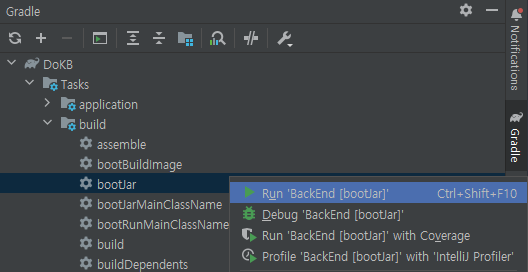
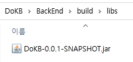

## Server 배포
### AWS EC2, RDS 정보
[Notion AWS EC2, RDS 정보 페이지 참고](https://www.notion.so/AWS-EC2-RDS-e805c2eb642e4695869f4aaee167651e)
___
### jar 파일 생성  
Gradle 탭에서 ```Task > build > bootJar``` 실행  



### jar 파일 서버에 복사  
```build > libs``` 폴더 안에 생성된 .jar 파일 서버에 복사



### jar 실행
```shell
java -jar DoKB-0.0.1-SNAPSHOT.jar
```
백그라운드 실행
```shell
nohup java -jar DoKB-0.0.1-SNAPSHOT.jar &
```

### 실행 종료
실행중인 jar PID 조회
```shell
$ ps -ef | grep DoKB
UID        PID  PPID  C STIME TTY          TIME CMD
centos   15014 14737  0 14:14 pts/1    00:00:19 java -jar DoKB-0.0.1-SNAPSHOT.jar
centos   15210 15047  0 15:09 pts/0    00:00:00 grep --color=auto DoKB
```
프로세스 종료
```shell
$ kill -9 [PID]
```